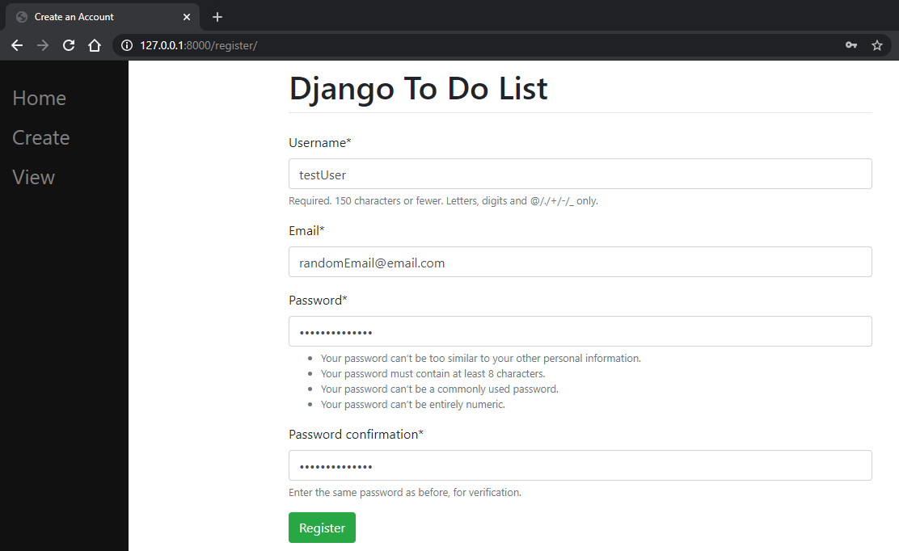
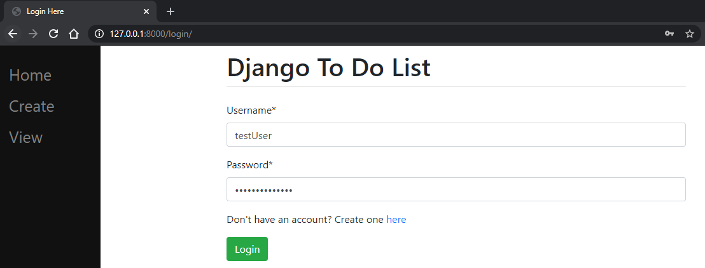
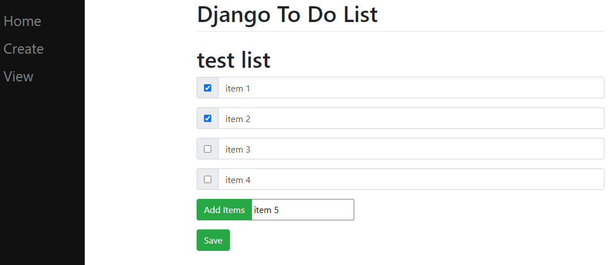

# django-todolist

Simple todolist written using Django

## Table of Contents

1. [About](#about)
2. [Prerequisites](#prerequisites)
3. [Installation](#installation)
4. [Screenshots](#Screenshots)
5. [Links](#links)

## About

A small functional todo list application built using Django. Users can register an account, sign in, and access their own personal todo list. Can create, update, and delete elements from the list/list itself.

## Prerequisites

1. Python 3.9+ **[Download](https://www.python.org/downloads/)**
2. Django 3.2+ **[Download](https://www.djangoproject.com/download/)**

## Installation

1. Clone, and run

```bash
$ git clone https://github.com/tu-nguyen/django-todolist.git && cd django-todolist
$ python manage.py runserver
```

## Screenshots

[](screenshots/djangotodoimg1.PNG)
[](screenshots/djangotodoimg2.PNG)

[](screenshots/djangotodoimg3.PNG)
